# 我报名了 GOAI 材料赛道，一周里大半时间在修 Docker

#GOAI大赛 #AI4S #Datawhale

官网：https://goaihz.com  
（赛程以官网为准；赛道三这边 Datawhale 也有参与）

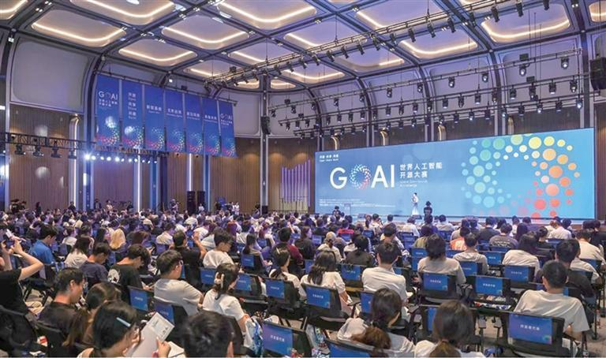

*图：GOAI 世界人工智能开源大赛启动现场。图源：[杭州影像](https://pic.hangzhou.com.cn/hzyx/content/content_9261256.html)*

---

先说清楚：这不是获奖感言，我初赛都还在赶。只是把这几天真实做过的事记下来，给同样想参赛、又怕手册太硬的人看一眼。

我报的是 **GOAI 世界人工智能开源大赛**，赛道三「前沿探索」，算法题里的第三个方向：用 AI 读材料科学文献，找出值得继续挖的研究空白，再往构效关系上走一步。

名字很长，翻译成人话大概是：

> 别只让大模型写一篇漂亮综述。你得能搜到论文、读到正文、指出缺口，并且说清楚「这句话出自哪篇哪一段」。如果再大胆一点，还可以提出材料结构与性能的假说，拿公开数据库去核一下。

从 7 月底到 8 月初，大概一周。本地演示早就通了，真要跑「下载开放获取 PDF → 解析全文 → 出带出处的结论」，环境和验收折腾了我很久。


---

## 这场比赛到底想要什么？

GOAI 老提三件事：**能跑、别人能照着复现、结论能查**。PPT 讲得再天花乱坠，评委也更想看仓库和日志。

赛道三两条路，互不影响：

- **算法赛**：题目给定方向，你按要求做方案和代码。
- **开放探索**：自己提一个还没公认答案的科学问题，做成 AI 能反复试的环境。

算法赛又分三个方向（最后是放一起比的，选哪个只是入口不同）：

1. 虚拟细胞一类的预测题  
2. 小分子和蛋白质结合轨迹  
3. **材料文献智能体（我选的这个）**

材料这个方向，可以粗暴理解成两半：

- 一半分：文献调研——检索、抽取信息、找研究缺口（Research Gap）、写出带引用的报告。  
- 一半分：进阶路线——构效关系 / 模拟 / 合成，三选一做深。我选了**构效关系**。

官方常提到的工具包括 Sciverse（搜文献）、MinerU（把 PDF 拆成能用的文本）、Materials Project 这类材料数据库。赛道相关开源社区里也能看到 Datawhale 的身影：

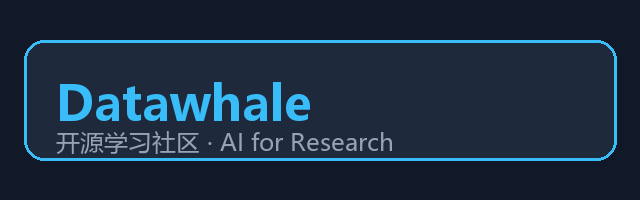

再直白一点——

评委不太想看到：

> 我问了 ChatGPT，它给我写了篇很完整的材料综述。

他们更想看到：

> 这几条「研究空白」每条都能点回原文；假说提出来以后，还拿公开数据库对过，对得上或对不上都有记录。

---

## 我为什么选这个方向？

另外两个方向，要么吃数据，要么吃 GPU。我这边算力一般，又更熟 Agent、检索和工程，所以选了材料方向。

科学题目我也故意选窄一点，围着 **SnSe、空位、导热** 这类具体问题转，不写「发现全新材料」那种大空话。题目越窄，越容易讲清楚你懂不懂、验没验过。

---

## 真正劝退的不是算法，是环境

按时间讲几件窝囊事。

### Docker 起不来

正式解析 PDF，我用了 Docker 跑 GROBID 等服务。结果引擎起不来，镜像也拉不动。系统盘空间、权限、WSL，哪个不对都不行。

后来我直接把 Docker **卸了重装到 H 盘**，数据也放到 H 盘，免得 C 盘被镜像撑爆。

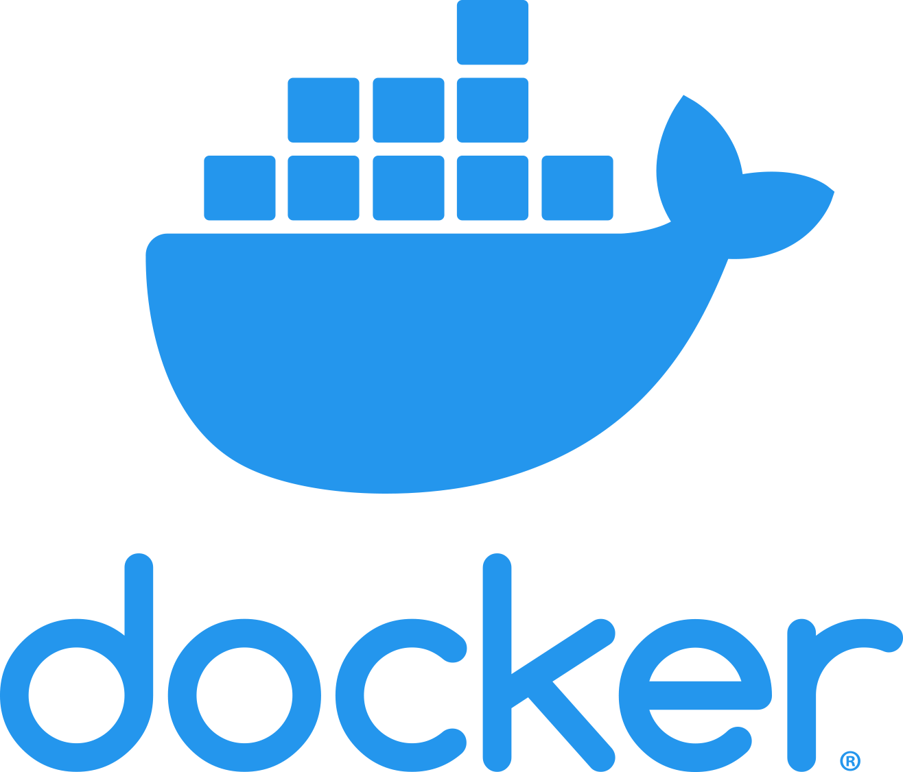

### 电脑虚拟化没开

重启进 BIOS，把虚拟化打开。不开这个，Docker 经常就是装了也白装。

### VPN 挡路

拉 Docker 镜像时，连官方仓库都连不上。关了干扰用的 VPN，防火墙里放行相关域名，才慢慢拉完。等镜像的时候别干坐着，文档、测试、不依赖 Docker 的活可以一起干。

### 用本地缓存「假装」读过全文

有几轮正式验收直接挂了：系统发现我拿本地缓存文本冒充网上的全文。后来规矩定死——开放获取下不到就记原因跳过，**绝不拿摘要或缓存糊弄成「已读全文」**。

### 大模型额度不够 / 调用失败

构效搜索那一步，有时日志里会写「大模型打分不可用」。我选择如实记录，而不是假装模型一直在环里干活。缺额度就充；某条调用链路不通，就保留另一条备用。比赛里，装成功比承认失败更危险。

### 密钥

所有 Key 只放在 `.env` 里。聊天里、截图里、文章里都别贴。不小心贴出去了，马上去后台换掉。

装好依赖、填好 `.env`、Docker 服务起来之后，正式跑大概是：

```bash
cd tracks/algorithm/materials_agent
pip install -r requirements.txt
copy .env.example .env

docker compose up -d grobid qdrant
python scripts/run_survey.py survey -c configs/production.yaml
python scripts/verify_production.py -c configs/production.yaml
```

成功的话，输出目录里会有一份验收结果，状态是 PASS：

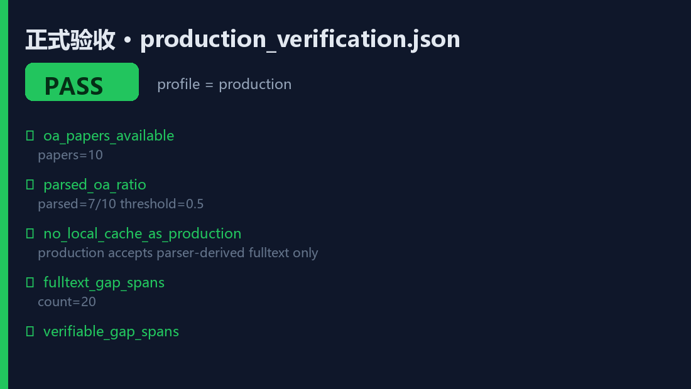

*图：`production_verification.json` 验收通过。10 篇文献，解析 7/10，全文证据 span 20 条。*

---

## 我现在做成了什么（尽量少讲黑话）

整条链路可以想成：

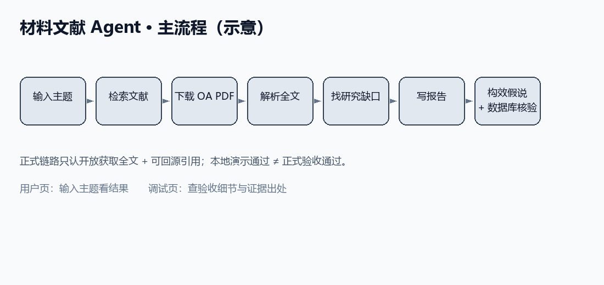

用到的公开工具大致是这些（Logo 仅说明用途）：

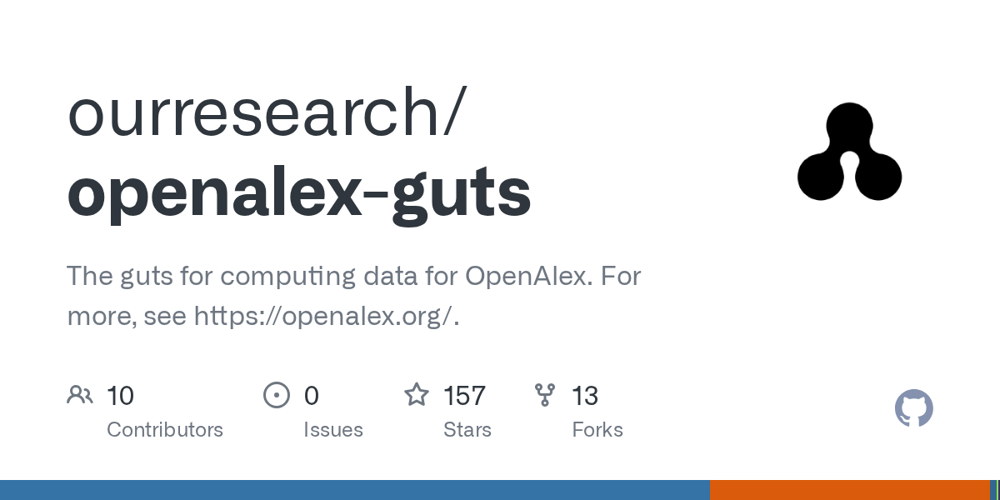

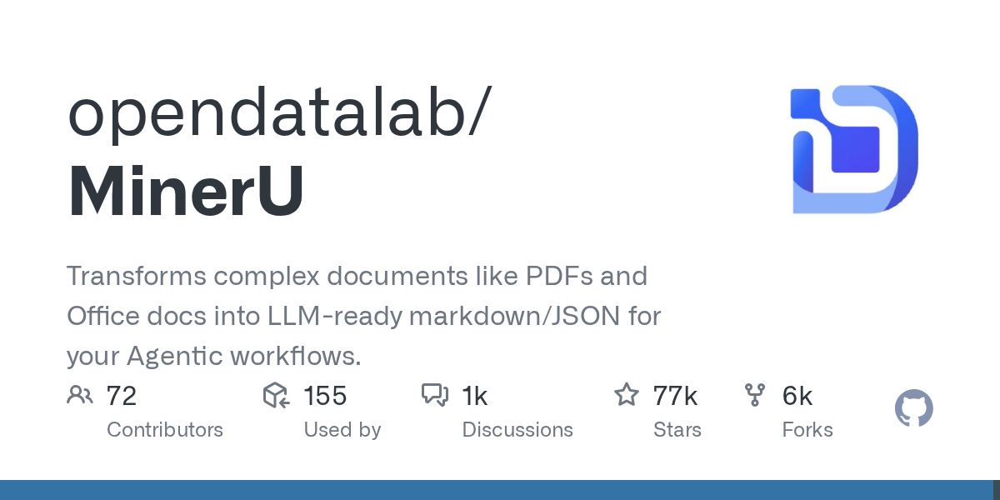

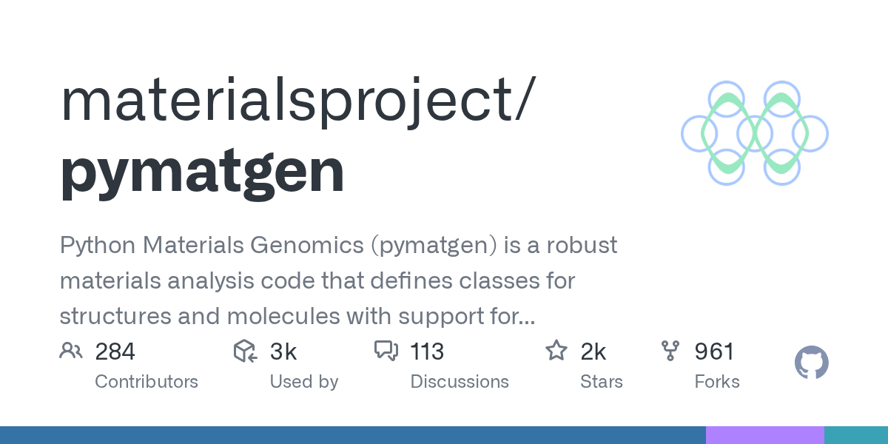

文字版步骤：

1. 你给一个研究主题  
2. 程序帮你改写成更好搜的查询  
3. 去公开文献库检索（默认 OpenAlex；有权限也可以接 Sciverse）  
4. 只下载**合法的开放获取** PDF，付费墙不硬闯  
5. 用 MinerU 等工具把 PDF 拆成可检索的正文片段  
6. 抽出结构化信息；没有出处的句子直接丢掉  
7. 标出「大家已经很熟的区域」，避免把常识当重大发现  
8. 找出研究缺口，并写上下一步可以怎么验证、怎么证伪  
9. 生成可读报告，同时留下操作日志  

进阶的构效部分，大致是：根据缺口提出假说 → 打分筛选 → 必要时调整方向 → 拿 Materials Project 等库核一下稳不稳定。

到 8 月初左右，正式验收能过。大约 10 篇文献里，有 7 篇左右真正解析出了全文；研究缺口都挂着正文引用。

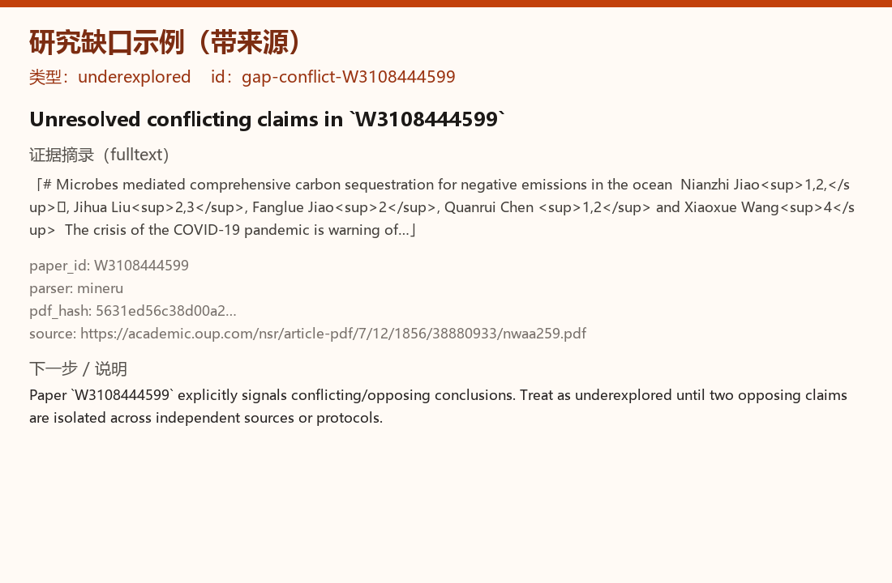

*图：某一条缺口的证据摘录、解析器和来源信息。*

为了演示，我做了两个网页（一个服务开两个入口）：

- **用户页**：输入主题，看结果。适合验收的人「当普通用户」点一点。  
- **调试页**：看验收细节、全文从哪来、引用能不能对上。适合自己查问题。

启动：

```bash
python scripts/serve_viewer.py
```

浏览器打开本地的 8765 端口就行。

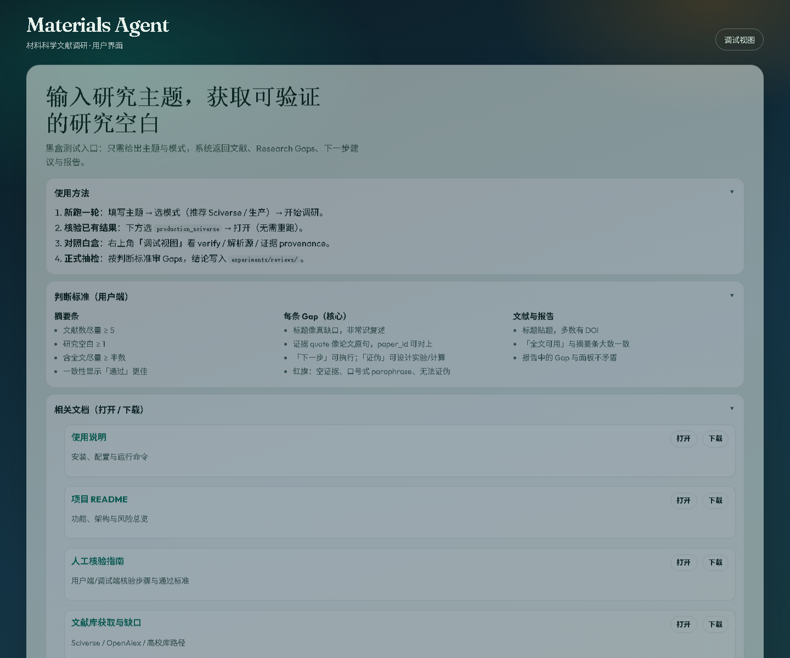

*图：用户端首页——主题输入、使用方法、判断标准、相关文档下载。*

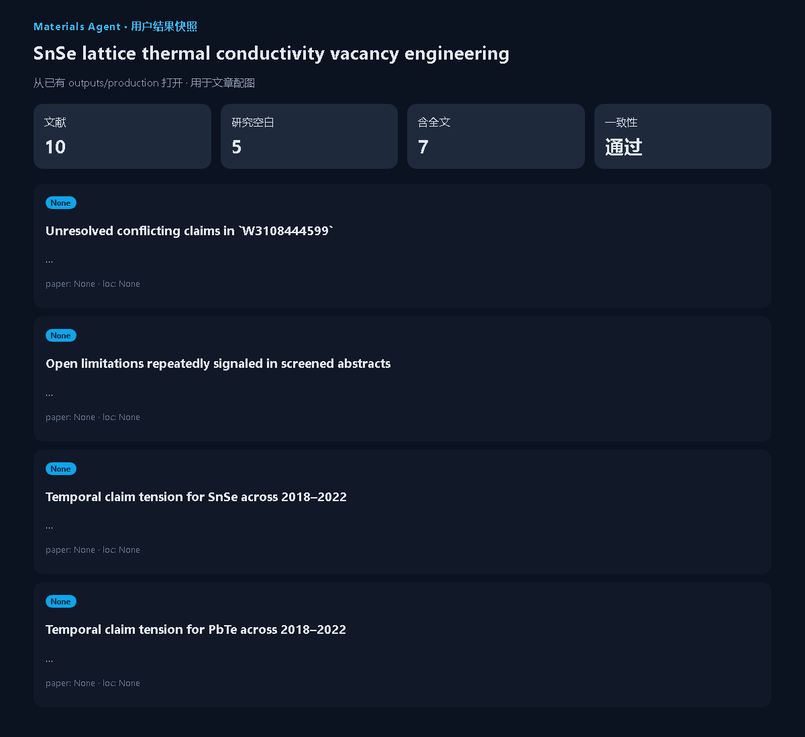

*图：打开已有 production 运行后的结果摘要（文献 10 / 空白 5 / 全文 7 / 一致性通过）。*

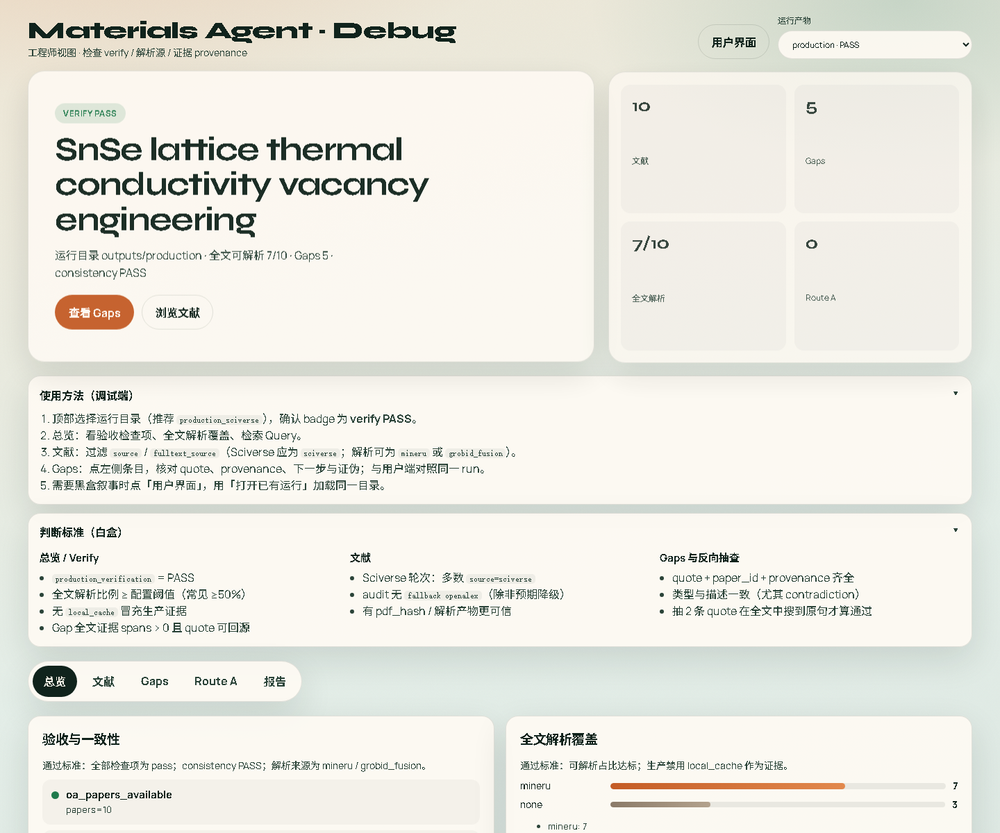

*图：调试端白盒视图，主题为 SnSe 空位导热；VERIFY PASS，全文解析 7/10。*

后来还加了文献按「主题+时间」归档、人工核对步骤说明、页面上的判断标准链接——主要是怕评委和队友十分钟看不懂你在干嘛。

---

## 这一周大概怎么熬过来的

不写成打卡表，就按感觉讲：

前两天，我把本地能补的功能补齐了，checklist 全绿。当时有点飘。晚上冷静下来一想：全绿只说明「小样例通了」，离正式链路还远，赶紧把这句警告写进文档，免得自己骗自己。

接着上全文链路。理论路径很清楚，一跑就撞上 Docker。重装、开虚拟化、关 VPN、等镜像，折腾了一天多。中间重启电脑好几次。

环境通了以后，正式跑也不是一次成功。前面几轮有的缺目录、有的参数不对、有的被「假全文」卡住。这些失败我没当最终成绩，修完重跑，直到验收过关。

再往后偏「能给人看」：配好大模型、做网页、写使用说明。后来发现调试页太工程师向了，又单独做了用户页，方便别人黑盒试用。

最后两天在弄：文献到底该从哪些库搜、搜到的论文怎么归档、人工怎么抽查几条缺口是不是胡说。界面上也把「怎么判断好坏」写清楚一点。

回头看，修环境、重启、盯进度条，居然占了很多时间。但这些本来就是参赛的一部分。写进过程记录里，答辩时反而比「一切顺利」可信。

---

## 人要怎么抽查（别全信自动结果）

技术能不能跑，脚本说了算；科不科学，还得人看。

我的最小做法：

1. 跑完先打开用户页，看报告读不读得通，缺口像不像那么回事。  
2. 再开调试页，看全文是不是真下下来了、引用能不能对回原文。  
3. 随机抽几条缺口：引用是不是原文里的话？类型标得对不对？「下一步」是不是真能动手做？  
4. 记在抽检文件夹里，有分歧就写备注，别事后改口。

自动程序最容易犯的错，是自己编一个「重大空白」还自我感觉良好。人抽几条，能把这件事按住。

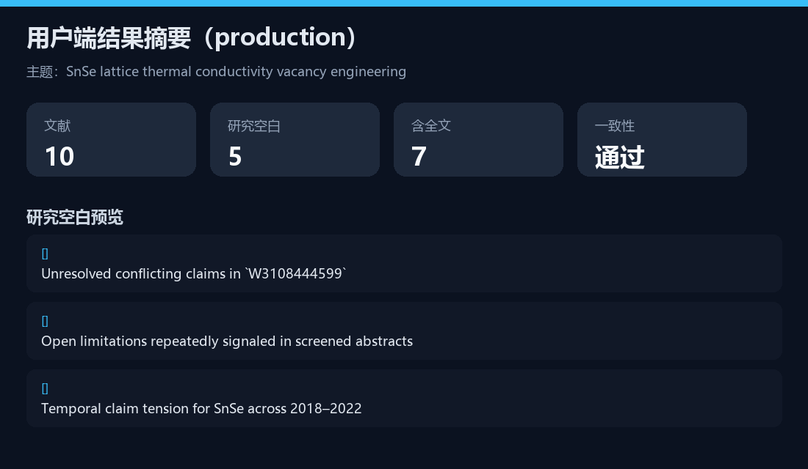

---

## 接下来我还要补什么

说人话版优先级：

1. 让大模型稳定参与构效搜索那几步（现在偶尔会掉线）。  
2. 官方更推荐的 Sciverse，有 Token 就认真跑一轮，并人工看一眼。  
3. 再提高 PDF 解析成功率（现在大概七成）。  
4. 多找人交叉抽检，别只自己看。  
5. 做几个对照：关掉工具 / 不用全文 / 不做数据库核验，成绩掉多少，故事才讲得清。  
6. 复赛前提前把依赖、哪些用了商业接口写明白。

初赛方案里，写清楚「我理解什么问题、打算怎么做、现在已经跑通过什么」就够了。没做成的事，别写成做成了。

---

## 如果你也要做，我只想叮嘱这几句

1. 先看自己有没有卡、有没有数据，再选题。没 GPU 就别硬刚特别吃算力的方向。  
2. 演示配置和正式配置分开，别拿演示成绩当正式成绩。  
3. 先把「怎么证明我真的跑通了」写出来，再堆花活。  
4. 没有出处的句子，直接删。  
5. 不爬付费墙；摘要不能冒充全文。  
6. 密钥放本地配置文件，并准备好调用额度。  
7. Docker 卡死时，去做文档和测试，别干等。  
8. 做两个入口：一个给外人点，一个给自己查。  
9. 模型挂了就写挂了，比假装一直很聪明更安全。  
10. 科学问题选窄一点，好讲、好验、也好答辩。

---

## 收个尾

这周最大的收获不是又调通了一个功能，而是逼自己把「感觉差不多」变成「验收脚本说通过」。中间修 Docker、进 BIOS、关 VPN、等镜像，确实狼狈，但也就在这时候，才体会到比赛说的「能跑、能复现、能核对」到底有多具体。

材料赛道难的不是多问大模型一句，而是让每一句结论都经得起点回去。

初赛还在路上。你要是也在做类似的事，评论区随便聊聊踩过的坑。

---

**发知乎时记得带**：`#GOAI大赛` `#AI4S` `#Datawhale`

发文时把 `docs/images/zhihu/` 里的图片**上传到知乎编辑器**（比外链稳）。新闻现场图请保留出处说明。

赛程和奖项以官网与手册为准；上文只是个人过程记录。

---

## 本地配图目录

全部文件在：`docs/images/zhihu/`

| 文件 | 用在哪 |
|------|--------|
| `00_goai_launch_1.jpg` / `_2.jpg` | 开头赛事现场 |
| `01_pipeline_overview.png` | 主流程示意 |
| `02_user_ui.png` | 用户界面首页 |
| `02b_user_result_summary.png` | 结果摘要卡片 |
| `02c_user_results_page.png` | 打开 production 后的结果页 |
| `03_production_verify_pass.png` | 正式验收 PASS |
| `04_gap_with_evidence.png` | 缺口 + 证据链 |
| `05_debug_ui_production.png` | 调试端 VERIFY PASS |
| `logo_*.png` | 工具 / 社区说明 |

重新生成截图可运行：

```bash
# 先开界面
cd tracks/algorithm/materials_agent
py -3 scripts/serve_viewer.py

# 另开终端
py -3 docs/scripts/collect_zhihu_images.py
```
