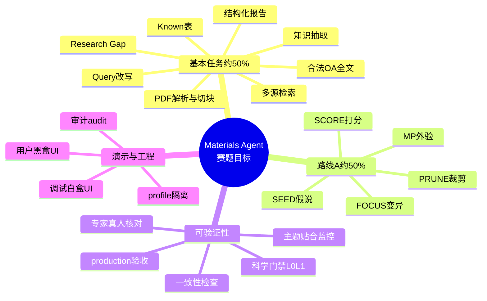
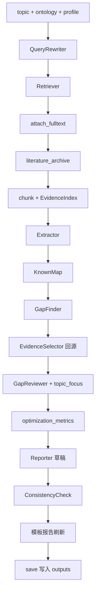
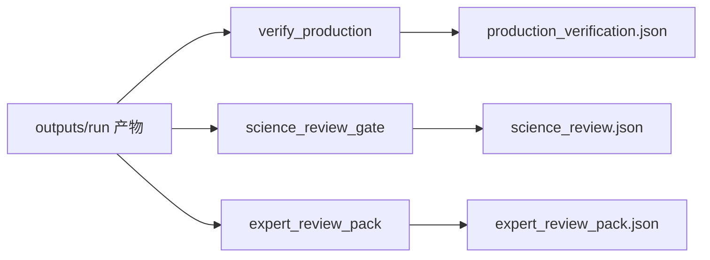
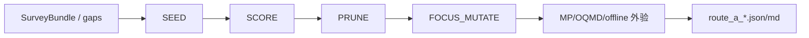
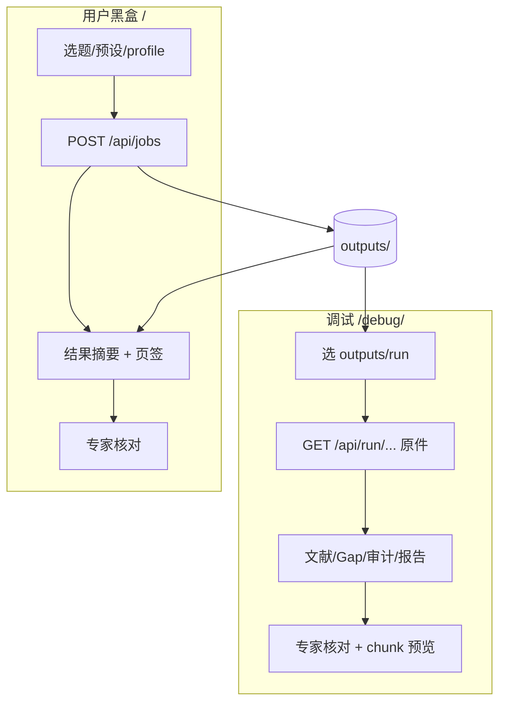

# Materials Agent

GOAI 赛道三 · 算法赛 · 方向三：**材料科学文献驱动的科学发现智能体**。

本目录是可提交工程：在不破坏已验证生产证据链的前提下，交付「可运行 / 可复现 / 可验证」的文献调研 + 构效假说搜索，并配套黑盒验收与工程师调试界面。

| 文档 | 用途 |
|------|------|
| 本文件 | 目标、功能全景、成果生成逻辑、入口、风险 |
| [`使用说明.md`](使用说明.md) | 安装、配置、命令、双界面操作 |
| [`完成度与优化方向.md`](完成度与优化方向.md) | 赛题对照与冲分 ROI |
| [`readme_agent.md`](readme_agent.md) | 出题口径与方法论深度材料 |
| [`DEPENDENCIES.md`](DEPENDENCIES.md) | 依赖、降级、OA 合规 |

---

## 1. 项目目标 ↔ 功能全景



| 模块 | 赛题权重意图 | 关键能力 | 主入口 |
|------|--------------|----------|--------|
| 文献调研 | 基本任务 ~50% | 检索→全文→Gap→报告 | `run_survey.py` + `configs/*.yaml` |
| 路线 A | 方法创新 ~50% | SPR 搜索环 + 材料库外验 | `run_route_a.py` / `--route-a` |
| 工程验收 | 可验证 | OA 解析率、quote⊂原文、无 local_cache 冒充 | `verify_production.py` |
| 科学门禁 | 科学意义 ~30% | L0 机械 + L1 双评 | `science_review_gate.py` |
| 专家核对 | 答辩补强 | 33 条标准 × 运行对象 | 双端「专家核对」页签 |
| Web 演示 | 验收体验 | 黑盒提交 / 白盒回放 | `serve_viewer.py` |

---

## 2. 端到端成果生成逻辑

### 2.1 主调研流水线（一次 `survey`）



| 步骤 | 实现 | 生成逻辑（摘要） | 直接产物 |
|------|------|------------------|----------|
| 改写 | `agents/query_rewriter.py` | 规则/LLM 多意图扩展，相关性过滤 | `queries.json` |
| 检索 | `tools/retrievers.py` | OpenAlex / local_json / Sciverse / Semantic Scholar | `papers.json`（后写） |
| 全文 | `tools/fulltext.py` + Unpaywall | 仅合法 OA；解析主备见配置 | PDF/`fulltext_index.json` |
| 归档 | `tools/literature_archive.py` | 主题目录落盘，便于人工抽检 | `data/<topic>_*/` + `literature_archive.json` |
| 索引 | `tools/chunking.py` + index | section chunk → file/Qdrant | `evidence_chunks.json` |
| 抽取 | `agents/extractor.py` | 材料/性质/方法/局限 + 证据消毒 | `extractions.json` |
| Known | `agents/known_map.py` | 高频材料–性质对，防「伪首次」 | `known_pairs.json` |
| Gap | `gap_finder` + `evidence_selector` | 提案后强制全文证据与 provenance | `gaps.json` |
| 评审 | `agents/gap_reviewer.py` | keep/revise/reject；主题材料门禁 | 写入 gaps |
| 监控 | `topic_focus.compute_optimization_metrics` | topic_hit、gap 对齐等 | `optimization_metrics.json` |
| 报告 | `agents/reporter.py` | 先 LLM/启发式草稿，一致性后再模板刷新 | `report.md` |
| 一致 | `agents/consistency.py` | paper_id / quote / provenance | `consistency.json` |
| 审计 | 全程 `AuditEvent` | 步骤、工具、降级原因 | `audit.json` + `bundle.json` |

**解析来源约定（已纠偏）：**

- 生产默认 `configs/production.yaml`：**GROBID 主解析**（Windows 上 MinerU 易挂死），`secondary: none`。
- `fulltext_source`：`mineru` | `grobid` | 旧跑次兼容 `grobid_fusion` | `none`；**禁止**把 `local_cache` 当生产全文。
- `default` / 部分 Route A 配置仍可 MinerU 主、GROBID 备。

### 2.2 流水线外门禁（不进 `pipeline.run`，按需执行）



| 门禁 | 证明什么 | 命令 / API |
|------|----------|------------|
| 工程验收 | OA 解析率、parser 来源、Gap 可回源 | `verify_production.py` |
| 科学门禁 | L0 硬项 + L1 抽样双评 | `science_review_gate.py` |
| 专家核对 | 33 条真人标准逐对象判决 | UI 页签或 `GET /api/runs/<id>/expert-review` |

三者正交：工程 PASS ≠ 科学 PASS ≠ 专家已看过。

### 2.3 路线 A 生成逻辑



| 产物 | 内容 |
|------|------|
| `route_a_spr_candidates.json` | 假说、打分、role_trace |
| `route_a_external_validation.json` | 外验 verdict / provider |
| `route_a_spr_report.md` | 可读排名表 |
| `route_a_run_summary.json` | 角色与外验摘要（`RouteASearcher.save` 与 CLI 均写） |

目标函数（软外验调整前）：`0.55*plaus + 0.30*gap_align + novelty_bonus - known_penalty`。

### 2.4 Web 双界面与产物消费



| 界面 | URL | 静态根 | 职责 |
|------|-----|--------|------|
| 用户 | `http://127.0.0.1:8765/` | `user/` | 黑盒：主题 → 结果，不暴露内部调试字段 |
| 调试 | `http://127.0.0.1:8765/debug/?run=production` | `viewer/` | 白盒：verify、provenance、audit |

---

## 3. 目录与配置剖面

```text
materials_agent/
├── README.md / 使用说明.md / DEPENDENCIES.md
├── configs/                 # demo_local · default · production · route_a · sciverse · s2
├── materials_agent/         # pipeline / agents / tools / routes
├── scripts/                 # CLI：survey / verify / science_review / serve_viewer / route_a
├── user/ · viewer/          # 双 UI
├── experiments/             # 金标准、科学/专家抽检
├── outputs/                 # 运行产物（勿提交密钥与受限 PDF）
├── data/                    # PDF、解析缓存、文献归档、Qdrant
└── tests/
```

| Profile | 检索 | 全文 | 解析 | 严格度 | 默认输出 |
|---------|------|------|------|--------|----------|
| `demo_local` | local_json | 关/缓存 | 无 | 松 | `outputs/demo` |
| `default` | OpenAlex | 默认可关下载 | MinerU+GROBID | 中 | `outputs/` |
| `production` | OpenAlex OA | Unpaywall 下载 | **GROBID 主** | 严 | `outputs/production` |
| `production_sciverse` | Sciverse（禁静默回退） | 同生产 | GROBID 主 | 严 | `outputs/production_sciverse` |
| `production_semantic_scholar` | S2→OA 回退 | 同生产 | MinerU+GROBID | 严 | 独立 out |
| `production_route_a` | 同生产族 | 同 | 可 MinerU 主 | 严 | `outputs/production_route_a` |

**纪律：** `demo` checklist PASS ≠ 生产已验证；对外只引用 `verify_production` 写出的 `production_verification.json` +（建议）`science_review.json`。`objective_review_run` **不得**覆盖前者（见 `objective_verify_shadow.json`）。

**Sciverse 叙事：** `production_sciverse` = 证据链金标（LLM off）。LLM 发现叙事请用 `configs/production_sciverse_llm.yaml`，勿混指。复现剧本：`scripts/reproduce_production_sciverse.ps1`。答辩索引：`experiments/reviews/defense_pack.md`。

---

## 4. 主流程入口

| 场景 | 命令 |
|------|------|
| 离线 smoke | `python scripts/run_survey.py survey -c configs/demo_local.yaml` |
| 生产证据链 | `python scripts/run_survey.py survey -c configs/production.yaml` |
| 生产验收 | `python scripts/verify_production.py -c configs/production.yaml` |
| 科学门禁 | `python scripts/science_review_gate.py -c configs/production.yaml --run outputs/production` |
| Route A | `python scripts/run_route_a.py -c configs/production_route_a.yaml --bundle-dir outputs/production` |
| Web | `python scripts/serve_viewer.py` |
| 健康检查 | `python scripts/healthcheck.py -c configs/production_sciverse.yaml` |
| Sciverse 复现 | `scripts/reproduce_production_sciverse.ps1` |
| 回归 | `pytest tests -q` |

最小本地验证：

```bash
cd tracks/algorithm/materials_agent
pip install -r requirements.txt
copy .env.example .env

python scripts/run_survey.py survey -c configs/demo_local.yaml
python scripts/verify_checklist.py
python scripts/serve_viewer.py
# http://127.0.0.1:8765/
```

生产闭环（需 Docker；当前生产解析以 GROBID 为主）：

```bash
docker compose up -d grobid qdrant
python scripts/run_survey.py survey -c configs/production.yaml
python scripts/verify_production.py -c configs/production.yaml
python scripts/science_review_gate.py -c configs/production.yaml --run outputs/production
```

---

## 5. 创新点（提交口径）

1. **证据一等公民**：生产 Gap 强制全文 location + provenance（URL / PDF hash / chunk）。
2. **profile 隔离**：demo / default / production 分轨，杜绝 smoke 偷换生产叙事。
3. **合法 OA 多候选**：Unpaywall 仓库镜像优先；不绕过付费墙。
4. **LLM 进搜索环**：Route A SEED/SCORE/MUTATE 有 `role_trace`，可接真 Materials Project。
5. **分层验收**：工程 verify · 科学 gate · 专家 33 标准 UI，互不冒充。
6. **双界面**：黑盒评测与白盒排障分离。
7. **诚实降级**：解析失败 / LLM 无额度 / MP 未命中写入 audit，不静默伪造成功。

---

## 6. 不足与风险

1. OA 覆盖受出版商限制，无法合规吹到「任意主题 10/10 全文」。
2. 解析与索引依赖 GROBID/Qdrant（可选 MinerU）；冷启动耗时。
3. LLM / MP Key 与额度决定 Route A「真 LLM + 真外验」材料强度。
4. 科学意义仍建议保留真人抽检归档（专家核对页签）。
5. 金标准 coverage 需继续扩标后再强调 accuracy。
6. `.env`、日志、镜像提交前必须脱敏。

---

## 7. 当前可用材料

| 材料 | 路径 |
|------|------|
| 生产验收 | `outputs/production/production_verification.json` |
| 科学门禁 | `outputs/production/science_review.json` |
| 专家核对包 | `outputs/production/expert_review_pack.json` |
| 专家标准 | `configs/expert_human_review_standards.json` |
| 人工/AI 抽检说明 | `experiments/reviews/` |
| Route A + MP | `outputs/production_route_a/`（若已跑） |
| 答辩包索引 | `experiments/reviews/defense_pack.md` |
| 免费库指南 | `docs/免费权威论文库与注册指南.md` |
| 双端对齐 | `/?run=` ↔ `/debug/?run=` + 对齐条 | 同源不同步；共享 verify/science/贴题指标 |

模块状态：调研流水线 ✅ · 生产证据链 ✅ · Route A ✅（视额度）· 双 UI ✅ · 科学/专家门禁 ✅ · 金标准骨架需充实。

---

## 8. 近期梳理与纠偏

相对旧文档/代码，本轮已对齐并修复：

| 问题 | 处理 |
|------|------|
| README 写「生产 = MinerU+GROBID」，实际 `production.yaml` 为 GROBID 主 | 文档与流程图改为 GROBID 主 |
| `fulltext_source=grobid_fusion` 在无融合时名不副实 | 新解析标为 `grobid`；验收兼容旧 `grobid_fusion` |
| fulltext audit 工具名恒为 `mineru_or_cache` | 改为 `fulltext_attach` / `pdf_parsers` |
| 科学抽检文档写 `l0/l1` 分文件与 `--use-llm` | 改为单一 `science_review.json`；LLM 指向 `ai_human_review.py` |
| Route A 经 `save()` 不写 `route_a_run_summary.json` | `RouteASearcher.save` 统一写出 |
| 管道 docstring 顺序与实现不符 | 已按真实 report→consistency→刷新 更新 |
| 残留 `_peek.py` 会改写 serve 脚本 | 已删除 |
| 用户任务 `user_jobs/<id>` 专家核对 404 | API 支持嵌套 run id；UI 保留完整相对路径 |
| `save()` 相对 CWD 写盘 | 相对路径一律锚定项目根 `ROOT` |
| UI 生产提示仍要求 MinerU | 改为 GROBID+Qdrant |
| Sciverse 缺 materials_db / 无效 pipeline 键 | 配置对齐；禁 offline 冒充外验 |
| `reground_production_gaps.py` 默认可毁产物 | 默认 dry-run，需 `--write` 且先 `.bak` |
| 陈旧 `build/` 毒化安装 | 已删；根 `.gitignore` 忽略 `build/`/`dist/` |
| Job 磁盘恢复绕过 sanitize | 走 `_public_from_run` / `attach_doc_links` |
| `verify_production` 写死 profile 名 | 使用配置文件 stem |

工程验收口令：`verify_production` · `science_review_gate` · 专家核对 UI 三者正交，不可互相替代。

---

## 附录：快速命令块

```bash
pip install -r requirements.txt
python scripts/run_survey.py survey -c configs/demo_local.yaml
python scripts/verify_checklist.py

docker compose up -d grobid qdrant
python scripts/run_survey.py survey -c configs/production.yaml
python scripts/verify_production.py -c configs/production.yaml
python scripts/science_review_gate.py -c configs/production.yaml --run outputs/production

python scripts/run_route_a.py -c configs/production_route_a.yaml --bundle-dir outputs/production
python scripts/serve_viewer.py
```
